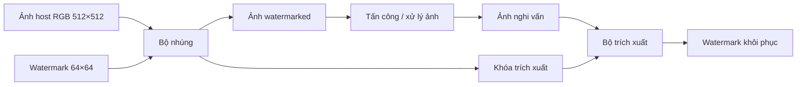

# TÀI LIỆU KỸ THUẬT BA PHƯƠNG PHÁP WATERMARKING ĐỀ XUẤT — [Historical core; xem thêm 3 proposal spatial không DCT]

> **Repository update — 4 September 2026.** The current public registry contains **eight proposals**. The six-method QR family consists of `dct_qr`, `dct_qr_direct_r`, `dct_qr_r11_qim` and the new non-DCT counterparts `spatial_qr`, `spatial_qr_direct_r`, `spatial_qr_r11_qim`. The independent `dct_schur_rescue` and `spatial_cd_detqr` proposals remain available. Historical three-method/five-method results below are preserved as historical evidence and do not describe the current registry size.

## DCT–QR Pairwise Coset QIM, DCT–Schur SP-SCQIM và Spatial Normalized-Residual DetQR

**Nguồn đối chiếu:** repository `Hanoi-main(10)`  
**Đối tượng:** ảnh host RGB `512 × 512`, watermark nhị phân `64 × 64` = `4096 bit`  
**Kiểu trích xuất:** blind có khóa hỗ trợ (*key-assisted blind*), không cần ảnh host gốc khi trích xuất.

---

## 1. Mục đích tài liệu

Tài liệu này trình bày rõ ràng **ba phương pháp lõi lịch sử** của repository; registry hiện tại đã mở rộng thành tám proposal như ghi ở phần cập nhật đầu tài liệu:

| ID trong code | Tên phương pháp hiện tại | Miền xử lý chính |
|---|---|---|
| `dct_qr` | **DCT–QR Pairwise Coset-Optimized Gain-Normalized QIM** | DCT + chứng chỉ QR + QIM |
| `dct_schur_rescue` | **DCT–Schur Spectrum-Preserving Orthogonal Coupling QIM (SP-SCQIM)** | DCT + tọa độ Schur tam giác trên |
| `spatial_cd_detqr` | **Spatial Normalized-Residual DetQR** | Miền không gian + QR + `det(A) ≠ 0` |

Mỗi phương pháp được mô tả theo cùng cấu trúc:

1. Ý tưởng cốt lõi.
2. Đại lượng toán học được sử dụng.
3. Quá trình nhúng watermark.
4. Quá trình trích xuất watermark.
5. Giả mã thuật toán.
6. Dữ liệu cần lưu trong khóa.
7. Ưu điểm, giới hạn và trạng thái hiện tại.

> **Lưu ý về phiên bản:** một số tài liệu cũ trong thư mục `docs/` vẫn mô tả DCT–Schur dưới dạng Schur reliability/gain điều khiển DCT-QIM. Tuy nhiên, public registry hiện tại gọi implementation trong `schur_coupling_qim.py`. Vì vậy, tài liệu này ưu tiên **mã nguồn đang được public API sử dụng**: SP-SCQIM với ba phép chiếu coupling trực giao.

---

# 2. Ký hiệu và quy ước chung

## 2.1. Ảnh host và watermark

- Ảnh host:

\[
I\in\{0,1,\ldots,255\}^{512\times512\times3}.
\]

- Watermark nhị phân:

\[
W\in\{0,1\}^{64\times64}.
\]

- Số bit watermark:

\[
N_w=64\times64=4096.
\]

- Ảnh được chia thành các block `8 × 8`. Với ảnh `512 × 512`:

\[
N_b=\frac{512}{8}\times\frac{512}{8}=64\times64=4096.
\]

Do đó, cả ba phương pháp đều có thể gắn tự nhiên một vị trí watermark với một block ảnh.

## 2.2. Trường quan sát màu

Hai phương pháp DCT sử dụng trường vô hướng kết hợp độ chói và đối kháng màu:

\[
F=0.299R+0.587G+0.114B
+\eta\left(R-\frac{G+B}{2}\right),
\]

trong đó mặc định:

\[
\eta=0.07.
\]

Viết lại:

\[
F=(0.299+\eta)R+(0.587-0.5\eta)G+(0.114-0.5\eta)B.
\]

Khi cần tạo một thay đổi \(\Delta F\) trong trường quan sát, implementation chiếu thay đổi đó ngược về RGB theo hướng có chuẩn nhỏ nhất phù hợp với vector hệ số trên.

## 2.3. QIM theo parity

Với bước lượng tử \(\Delta>0\), hai lớp QIM được định nghĩa bởi parity của chỉ số lượng tử:

\[
\mathcal Q_0(\Delta)=\{2k\Delta:k\in\mathbb Z\},
\]

\[
\mathcal Q_1(\Delta)=\{(2k+1)\Delta:k\in\mathbb Z\}.
\]

Một bit \(b\in\{0,1\}\) được nhúng bằng cách đưa sóng mang đến điểm gần nhất thuộc lớp \(\mathcal Q_b\), có thể kèm biên an toàn quanh ranh giới quyết định.

Khi trích xuất:

\[
\widehat q=\operatorname{round}\left(\frac{x}{\Delta}\right),
\qquad
\widehat b=\widehat q\bmod 2.
\]

## 2.4. Arnold scrambling

Hai phương pháp DCT biến đổi watermark bằng Arnold transform trước khi nhúng. Mục đích là phân tán các bit lân cận của watermark đến các block khác nhau.

Nếu \(S_A\) là phép Arnold với số vòng \(n_A\), payload dùng để nhúng là:

\[
w=\operatorname{vec}\left(S_A(W;n_A)\right).
\]

Sau khi trích xuất, dùng số vòng nghịch đảo theo chu kỳ Arnold để khôi phục bố cục watermark.

## 2.5. Khái niệm “blind” trong repository

Cả ba phương pháp không nhận ảnh host gốc ở đầu vào của hàm trích xuất. Tuy nhiên, khóa có thể lưu:

- lịch block;
- pattern đã chọn;
- mask/coset label;
- thống kê hoặc thang gain tham chiếu;
- vị trí pilot;
- các tham số giải mã.

Vì vậy, cách gọi chính xác nhất là:

> **Key-assisted blind watermarking** — trích xuất mù đối với ảnh host gốc, nhưng cần khóa được tạo trong quá trình nhúng.

---

# 3. Phương pháp 1 — DCT–QR Pairwise Coset-Optimized Gain-Normalized QIM

## 3.1. Tên và vị trí trong mã nguồn

- Method ID: `dct_qr`
- File chính: `src/qr64_certified/proposals/method.py`
- Chứng chỉ QR: `src/qr64_certified/proposals/certificate.py`
- Cấu hình: `src/qr64_certified/proposals/config.py`

## 3.2. Ý tưởng cốt lõi

Phương pháp này sử dụng QR theo ba vai trò khác nhau:

1. **Đánh giá độ ổn định của từng block** để chọn bước QIM cục bộ.
2. **Sắp xếp và ghép các block có độ tin cậy gần nhau** thành nhóm hai block.
3. **Ước lượng suy hao cục bộ bằng hệ số QR \(r_{11}\)** để bù gain khi trích xuất.

Sau khi QR tạo thứ tự ổn định, mỗi cặp block được phép dùng chung một nhãn coset nhị phân \(s_j\). Nhãn này được chọn sao cho tổng méo chiếu QIM của cả cặp là nhỏ nhất.

Do lựa chọn cũ \(s_j=0\) luôn là một phương án hợp lệ, tối ưu coset không thể làm tăng năng lượng chiếu QIM trong miền số thực.

---

## 3.3. Sóng mang DCT

Với block thứ \(b\), thực hiện DCT trực chuẩn:

\[
C_b=\operatorname{DCT}_{2D}(F_b).
\]

Sóng mang payload là hiệu hai hệ số AC tần số thấp:

\[
\boxed{
 v_b=\frac{C_b(0,1)-C_b(1,0)}{2}
}
\]

Việc dùng hiệu hai hệ số có hai lợi ích:

- ít phụ thuộc vào thành phần DC/độ sáng trung bình;
- phản ánh cấu trúc định hướng tần số thấp của block.

---

## 3.4. Ma trận phân tích QR

Từ vùng DCT tần số thấp `4 × 4`, xây dựng ma trận:

\[
A_b=C_b[0:4,0:4].
\]

Phần tử DC ảo được thay bởi hiệu định hướng:

\[
A_b(0,0)\leftarrow C_b(0,1)-C_b(1,0).
\]

Sau đó thêm diagonal lift:

\[
A_b\leftarrow A_b+\ell I_4,
\qquad \ell>0.
\]

Lift chỉ dùng để phân tích độ ổn định; nó không được nhúng trực tiếp vào ảnh.

Phân rã QR chuẩn hóa dấu:

\[
A_b=Q_bR_b,
\]

với đường chéo của \(R_b\) được ép không âm để loại bỏ nhập nhằng dấu của QR.

---

## 3.5. Chứng chỉ độ tin cậy QR

### 3.5.1. Định thức và cận ổn định

\[
d_b=|\det(A_b)|.
\]

Nếu:

\[
d_b\le \varepsilon_{\det},
\]

block không thỏa điều kiện chứng chỉ.

Một cận tính được cho giá trị kỳ dị nhỏ nhất là:

\[
\beta_b=\frac{|\det(A_b)|}{\|A_b\|_F^3+\varepsilon}.
\]

### 3.5.2. Cân bằng đường chéo QR

Nếu \(r_{ii}\) là đường chéo của \(R_b\):

\[
q_b^{\mathrm{bal}}
=
\frac{\min_i|r_{ii}|}{\max_i|r_{ii}|+\varepsilon}.
\]

Giá trị lớn biểu thị các hướng QR cân bằng hơn.

### 3.5.3. Mức coupling ngoài đường chéo

\[
q_b^{\mathrm{cpl}}
=
\frac{\|\operatorname{triu}(R_b,1)\|_F}
{\|R_b\|_F+\varepsilon}.
\]

### 3.5.4. Điểm reliability thô

Implementation dùng:

\[
r_b^{\mathrm{raw}}
=
\log(1+\beta_b)
+2q_b^{\mathrm{bal}}
+0.2\left(1-q_b^{\mathrm{cpl}}\right).
\]

Sau đó chuẩn hóa robust giữa phân vị 5% và 95%:

\[
r_b\in[0,1].
\]

- \(r_b\) nhỏ: block yếu, cần bước QIM lớn hơn.
- \(r_b\) lớn: block ổn định, có thể dùng bước nhỏ hơn để giảm méo.

---

## 3.6. Phân bổ bước QIM theo reliability

Sắp xếp block theo \(r_b\) tăng dần. Chia thành ba lớp:

\[
\Delta_b=
\begin{cases}
\Delta_{\mathrm{weak}}, & 20\%\text{ block yếu nhất},\\[2mm]
\Delta_{\mathrm{mid}}, & 40\%\text{ block tiếp theo},\\[2mm]
\Delta_{\mathrm{strong}}, & 40\%\text{ block ổn định nhất}.
\end{cases}
\]

Với public configuration mặc định của code:

\[
(\Delta_{\mathrm{weak}},\Delta_{\mathrm{mid}},\Delta_{\mathrm{strong}})
=(18.25,13.25,10.25).
\]

Khi chạy file `configs/dct_qr_after_abc.json`, các giá trị được thay bằng bộ tham số ABC đã tối ưu, nhưng luật phân ba lớp không thay đổi.

Biên QIM cục bộ là:

\[
\rho_b=\rho_{\mathrm{frac}}\Delta_b,
\qquad 0\le\rho_{\mathrm{frac}}<0.5.
\]

---

## 3.7. Tối ưu coset theo cặp block

Sau Arnold scrambling, bit logic tại block \(b\) là \(u_b\).

Ký hiệu:

\[
P_c(v_b;\Delta_b,\rho_b)
\]

là phép chiếu sóng mang \(v_b\) lên lớp QIM parity \(c\), đồng thời thỏa biên an toàn \(\rho_b\).

Các block được sắp theo QR reliability rồi chia thành nhóm:

\[
G_j=\{b_{j,1},b_{j,2}\}.
\]

Với mỗi nhóm, thử hai nhãn chung \(s\in\{0,1\}\):

\[
E_j(s)
=
\sum_{b\in G_j}
\left|
P_{u_b\oplus s}(v_b)-v_b
\right|^2.
\]

Chọn:

\[
\boxed{
 s_j^*=\arg\min_{s\in\{0,1\}}E_j(s)
}
\]

Bit vật lý thực sự được ghi vào QIM là:

\[
\boxed{
 c_b=u_b\oplus s_j^*
}
\]

và sóng mang mục tiêu là:

\[
\boxed{
 v_b^*=P_{c_b}(v_b;\Delta_b,\rho_b).
}
\]

### Tính chất không tăng méo chiếu

Trường hợp không tối ưu tương ứng với \(s=0\). Vì \(s=0\) nằm trong tập phương án:

\[
\boxed{
 E_j(s_j^*)\le E_j(0).
}
\]

### Tính chất bảo toàn sự kiện lỗi bit

Khi giải mã:

\[
\widehat u_b=\widehat c_b\oplus s_j^*.
\]

Do XOR với cùng một nhãn ở hai phía:

\[
\mathbf 1[\widehat u_b\ne u_b]
=
\mathbf 1[\widehat c_b\ne c_b].
\]

Coset inversion không tự tạo thêm lỗi bit; lỗi chỉ xuất hiện nếu parity QIM vật lý bị giải mã sai.

---

## 3.8. Quá trình nhúng DCT–QR

### Đầu vào

- Ảnh host RGB \(I\).
- Watermark \(W\).
- Cấu hình QR-QIM.

### Các bước

1. Kiểm tra ảnh `512 × 512 × 3` và watermark `64 × 64`.
2. Chuyển watermark sang bit \(0/1\).
3. Tạo trường quan sát \(F\).
4. Chia \(F\) thành 4096 block `8 × 8`.
5. Tính DCT cho từng block.
6. Xây dựng ma trận phân tích \(A_b\) và chứng chỉ QR.
7. Tạo lịch payload và pilot bằng seed.
8. Arnold-scramble watermark.
9. Phân bổ \(\Delta_b\) theo reliability.
10. Nhúng pilot bằng sóng mang pilot của engine nền.
11. Tính lại sóng mang payload sau khi pilot đã được ghi.
12. Sắp block theo reliability và ghép cặp.
13. Tối ưu nhãn coset \(s_j^*\) cho mỗi cặp.
14. Chiếu từng sóng mang đến lớp QIM tương ứng.
15. Thực hiện integer-lattice closure để bảo đảm parity đúng sau phép làm tròn RGB.
16. Tính thang gain QR tham chiếu trên ảnh watermarked cuối cùng.
17. Lưu lịch block, bước cục bộ, coset mask, gain reference và cấu hình vào khóa.

### Bù gain bằng QR `r11`

Ở chế độ `carrier_r11`, dùng ma trận phân tích không lift và QR chuẩn hóa:

\[
A_b^{(0)}=Q_bR_b.
\]

Thang gain cục bộ là:

\[
\boxed{
 g_b^{QR}=|r_{11,b}|=\|A_b^{(0)}[:,0]\|_2.
}
\]

Thang này gắn với cột tần số thấp chứa sóng mang QIM, thay vì lấy năng lượng trung bình trên toàn bộ ma trận.

---

## 3.9. Quá trình trích xuất DCT–QR

### Đầu vào

- Ảnh nghi vấn hoặc ảnh bị tấn công \(I_a\).
- Khóa `QR64Key`.

Không sử dụng ảnh host gốc và watermark gốc.

### Các bước

1. Đọc cấu hình, lịch payload, pilot, bước \(\Delta_b\), coset mask và gain reference từ khóa.
2. Tính điểm pilot trên ảnh đầu vào.
3. Sinh các ứng viên căn chỉnh từ engine đồng bộ.
4. Đánh giá mỗi ứng viên bằng:
   - điểm pilot;
   - độ nhất quán của chứng chỉ QR;
   - phạt mức biến đổi hình học.
5. Chỉ chấp nhận phép căn chỉnh nếu objective tăng đủ so với giả thuyết identity.
6. Tính sóng mang DCT trên ảnh đã căn chỉnh.
7. Tính thang QR hiện tại \(g_b\).
8. Ước lượng tỷ lệ gain:

\[
\alpha_b
=
\operatorname{clip}
\left(
\frac{g_b}{g_b^{0}},
\alpha_{\min},
\alpha_{\max}
\right).
\]

9. Chuẩn hóa sóng mang:

\[
\boxed{
 \widetilde v_b
 =
 \frac{v_b}{\alpha_b^{\gamma}}
}
\]

10. Giải mã parity QIM:

\[
\widehat c_b
=
\operatorname{round}
\left(
\frac{\widetilde v_b}{\Delta_b}
\right)\bmod2.
\]

11. Hoàn nguyên coset:

\[
\widehat u_b=\widehat c_b\oplus s_j^*.
\]

12. Đưa các bit về ma trận `64 × 64`.
13. Thực hiện inverse Arnold transform.
14. Nếu ảnh sạch hoặc độ tin cậy rất cao, trả về bit trực tiếp.
15. Nếu bằng chứng không chắc chắn, kết hợp:
   - confidence QIM;
   - QR reliability;
   - prior lân cận bằng ICM/MAP;
   để làm quyết định cuối.

### Confidence QIM

Với:

\[
y_b=\frac{\widetilde v_b}{\Delta_b},
\qquad
q_b=\operatorname{round}(y_b),
\]

confidence là:

\[
\kappa_b
=
\operatorname{clip}
\left(
1-2|y_b-q_b|,0,1
\right).
\]

Giá trị gần 1 nghĩa là sóng mang nằm gần tâm ô lượng tử; giá trị gần 0 nghĩa là nằm gần ranh giới quyết định.

---

## 3.10. Giả mã thuật toán nhúng DCT–QR

```text
ALGORITHM DCT_QR_EMBED(I, W, config)
INPUT:
    I       ảnh host RGB 512×512
    W       watermark nhị phân 64×64
    config  tham số QIM, QR, pilot, gain và MAP
OUTPUT:
    Iw      ảnh watermarked
    K       khóa trích xuất

1.  w ← ArnoldScramble(Binarize(W))
2.  F ← OpponentField(I, eta)
3.  C ← BlockDCT8x8(F)
4.  A ← BuildLifted4x4AnalysisMatrices(C)
5.  cert ← CanonicalQRCertificate(A)
6.  payload_schedule, pilot_schedule ← KeyedSchedules(config.seed)
7.  Delta[b] ← ReliabilityStepClass(cert.reliability[b])
8.  I0 ← EmbedPilots(I, pilot_schedule)
9.  v[b] ← DCTCarrier(I0, b)
10. Sort payload blocks by cert.reliability
11. Divide ordered blocks into pairs G_j
12. FOR each pair G_j:
13.     E0 ← total projection cost using bits w[b]
14.     E1 ← total projection cost using bits w[b] XOR 1
15.     s[j] ← 1 if E1 < E0 else 0
16.     c[b] ← w[b] XOR s[j], for b in G_j
17. END FOR
18. Iw ← IntegerLatticeQIMEmbed(I0, c, Delta, rho)
19. g0[b] ← QRCarrierR11Scale(Iw, b)
20. K ← Pack(schedule, Delta, pair labels s, g0, config, Arnold data)
21. RETURN Iw, K
```

## 3.11. Giả mã thuật toán trích xuất DCT–QR

```text
ALGORITHM DCT_QR_EXTRACT(Ia, K)
INPUT:
    Ia  ảnh nghi vấn
    K   khóa DCT–QR
OUTPUT:
    W_hat watermark khôi phục 64×64

1.  Ialign ← PilotAndCertificateAlignment(Ia, K)
2.  v[b] ← DCTCarrier(Ialign, b)
3.  g[b] ← QRCarrierR11Scale(Ialign, b)
4.  alpha[b] ← Clip(g[b] / K.g0[b], gain_clip)
5.  vtilde[b] ← v[b] / alpha[b]^gamma
6.  chat[b] ← Round(vtilde[b] / K.Delta[b]) mod 2
7.  uhat[b] ← chat[b] XOR K.pair_label[b]
8.  confidence[b] ← QIMCellConfidence(vtilde[b], K.Delta[b])
9.  U ← InverseArnold(Reshape(uhat, 64, 64))
10. IF clean identity OR high confidence:
11.     W_hat ← U
12. ELSE:
13.     W_hat ← QRWeightedICM_MAP(U, confidence, current_QR_certificate)
14. END IF
15. RETURN 255 × W_hat
```

---

## 3.12. Thành phần của khóa DCT–QR

Khóa có thể chứa:

- hình dạng ảnh và watermark;
- seed;
- lịch block payload và pilot;
- các bit pilot;
- số vòng và chu kỳ Arnold;
- bước QIM của từng payload block;
- coset flip mask đóng gói base64;
- thang gain QR tham chiếu của từng block;
- tóm tắt robust của chứng chỉ QR;
- tham số căn chỉnh và MAP.

Do đó, phương pháp không cần ảnh host gốc nhưng khóa không phải khóa kích thước rất nhỏ.

---

# 4. Phương pháp 2 — DCT–Schur Spectrum-Preserving Orthogonal Coupling QIM

## 4.1. Tên và vị trí trong mã nguồn

- Method ID: `dct_schur_rescue`
- Tên khoa học trong code: **SP-SCQIM**
- File chính: `src/qr64_certified/proposals/schur_coupling_qim.py`
- Wrapper public: `src/qr64_certified/proposals/direct_schur_rescue.py`

## 4.2. Ý tưởng cốt lõi

Thay vì dùng cùng sóng mang một chiều \((C_{01}-C_{10})/2\) như DCT–QR, phương pháp này chọn sáu hệ số DCT của mỗi block và diễn giải chúng như sáu phần tử tam giác trên nghiêm ngặt của một ma trận Schur tam giác trên `4 × 4`.

Từ vector sáu chiều đó, tạo ba sóng mang trực giao. Ba phiên bản hoán vị của payload được nhúng đồng thời vào ba sóng mang.

Luật cập nhật là phép chiếu trực giao dạng đóng:

\[
\boxed{
 n^*=n+H^T(t-Hn)
}
\]

Đây là cập nhật có chuẩn Frobenius nhỏ nhất thỏa đồng thời ba ràng buộc QIM.

---

## 4.3. Các tọa độ Schur coupling

Với mỗi block DCT \(C_b\), lấy sáu hệ số:

\[
(0,1),\ (1,0),\ (0,2),\ (1,1),\ (2,0),\ (1,2).
\]

Tạo vector coupling:

\[
\boxed{
 n_b=
\begin{bmatrix}
t_{12}&t_{13}&t_{14}&t_{23}&t_{24}&t_{34}
\end{bmatrix}^{T}
\in\mathbb R^6.
}
\]

Vector này được đặt vào phần tam giác trên nghiêm ngặt của ma trận ảo:

\[
T_b=
\begin{bmatrix}
\lambda_1&t_{12}&t_{13}&t_{14}\\
0&\lambda_2&t_{23}&t_{24}\\
0&0&\lambda_3&t_{34}\\
0&0&0&\lambda_4
\end{bmatrix}.
\]

Bốn phần tử đường chéo được lấy từ các vị trí DCT khác và được giữ nguyên trong phép nhúng coupling.

---

## 4.4. Ba cơ sở coupling trực giao

Implementation định nghĩa ba vector hàng trực chuẩn:

\[
h_1
=\frac{1}{\sqrt2}
[1,-1,0,0,0,0],
\]

\[
h_2
=\frac{1}{2}
[1,1,-1,-1,0,0],
\]

\[
h_3
=\frac{1}{\sqrt{12}}
[1,1,1,1,-2,-2].
\]

Gộp thành ma trận:

\[
H=
\begin{bmatrix}
h_1\\h_2\\h_3
\end{bmatrix}
\in\mathbb R^{3\times6}.
\]

Các hàng trực chuẩn nên:

\[
HH^T=I_3.
\]

Ba sóng mang của block là:

\[
\boxed{
 x_{b,k}=h_k^Tn_b,
\qquad k=1,2,3.
}
\]

---

## 4.5. Tạo ba bản payload xen kẽ

1. Arnold-scramble watermark:

\[
w=\operatorname{vec}(S_A(W)).
\]

2. Từ cùng seed, sinh ba permutation độc lập:

\[
\pi_1,\pi_2,\pi_3.
\]

3. Bit gán cho sóng mang thứ \(k\) tại block \(b\):

\[
\boxed{
 w_{k,b}=w_{\pi_k(b)}.
}
\]

Như vậy, mỗi bit logic xuất hiện trong ba bản hoán vị, nhưng không nhất thiết nằm cùng một block ở ba sóng mang.

> Đây là **ba bản payload interleaved** trong implementation hiện tại. Nó tạo voting diversity nhưng cũng làm phương pháp có cơ chế lặp payload ba lần ở mức sóng mang.

---

## 4.6. Mục tiêu parity gần nhất

Với sóng mang \(x_{b,k}\), bước \(\Delta\) và bit \(w_{k,b}\), tính chỉ số gần nhất:

\[
q_{b,k}=\operatorname{round}\left(\frac{x_{b,k}}{\Delta}\right).
\]

Nếu parity của \(q_{b,k}\) sai, chọn một trong hai số nguyên lân cận \(q_{b,k}-1\) hoặc \(q_{b,k}+1\) có parity đúng và gần \(x_{b,k}/\Delta\) hơn.

Mục tiêu là:

\[
\boxed{
 t_{b,k}=q_{b,k}^{*}\Delta,
\qquad
q_{b,k}^{*}\bmod2=w_{k,b}.
}
\]

Gộp ba mục tiêu:

\[
t_b=[t_{b,1},t_{b,2},t_{b,3}]^T.
\]

---

## 4.7. Luật chiếu minimum-Frobenius

Cần tìm \(n_b^*\) gần \(n_b\) nhất sao cho:

\[
Hn_b^*=t_b.
\]

Bài toán:

\[
\min_{z\in\mathbb R^6}\|z-n_b\|_2^2
\quad\text{s.t.}\quad Hz=t_b.
\]

Vì các hàng của \(H\) trực chuẩn, nghiệm chiếu trực giao là:

\[
\boxed{
 n_b^*=n_b+H^T(t_b-Hn_b).
}
\]

### Kiểm tra ràng buộc

\[
Hn_b^*
=Hn_b+HH^T(t_b-Hn_b)
=t_b.
\]

### Tính tối ưu

Phần cập nhật:

\[
\Delta n_b=H^T(t_b-Hn_b)
\]

nằm trong không gian hàng của \(H\). Mọi cập nhật khác thỏa ràng buộc đều bằng cập nhật này cộng với một vector thuộc null-space của \(H\), nên có chuẩn Euclid lớn hơn hoặc bằng.

Vì sáu phần tử \(n_b\) chính là sáu phần tử strict-upper của ma trận Schur ảo, tối thiểu \(\|\Delta n_b\|_2\) đồng thời là tối thiểu thay đổi Frobenius trên phần coupling.

---

## 4.8. Bảo toàn phổ, vết và định thức trong phép chiếu hệ số

Ma trận \(T_b\) là tam giác trên. Các trị riêng của ma trận tam giác chính là các phần tử đường chéo:

\[
\sigma(T_b)=\{\lambda_1,\lambda_2,\lambda_3,\lambda_4\}.
\]

Phép nhúng chỉ thay strict-upper, không thay đường chéo. Do đó, trong mô hình hệ số số thực:

\[
\boxed{
\sigma(T_b^*)=\sigma(T_b)
}
\]

\[
\boxed{
\operatorname{tr}(T_b^*)=\operatorname{tr}(T_b)
}
\]

\[
\boxed{
\det(T_b^*)=\det(T_b)=\prod_{i=1}^{4}\lambda_i.
}
\]

> Phát biểu bảo toàn này đúng cho **ma trận Schur ảo được xây dựng trước/sau phép chiếu coupling trong miền hệ số số thực**. Sau IDCT, chiếu về RGB nguyên `uint8`, clipping và closure, các bất biến của ma trận tái tính từ ảnh cuối có thể có sai số làm tròn; không nên tuyên bố ảnh vật lý bảo toàn tuyệt đối các bất biến trong mọi bước.

---

## 4.9. Quá trình nhúng SP-SCQIM

### Các bước

1. Kiểm tra ảnh host `512 × 512 × 3` và watermark `64 × 64`.
2. Nhị phân hóa watermark.
3. Arnold-scramble watermark.
4. Tạo ba permutation payload từ seed.
5. Tạo ba dãy bit \(w_1,w_2,w_3\).
6. Tạo trường quan sát \(F\).
7. Chia thành 4096 block `8 × 8` và tính DCT.
8. Với mỗi block:
   - lấy vector coupling \(n_b\in\mathbb R^6\);
   - tính ba sóng mang \(Hn_b\);
   - tìm ba mục tiêu parity gần nhất \(t_b\);
   - cập nhật \(n_b^*=n_b+H^T(t_b-Hn_b)\).
9. Ghi sáu coupling mới về các vị trí DCT.
10. IDCT từng block để tái tạo trường quan sát.
11. Chiếu thay đổi trường quan sát về RGB và làm tròn `uint8`.
12. Kiểm tra lại parity của cả ba bản payload trên ảnh vật lý.
13. Nếu còn lỗi và chưa vượt `closure_rounds`, lặp lại phép chiếu từ ảnh hiện tại.
14. Sau vòng cuối, tính thang spectral reference của từng block.
15. Lưu reference, seed, Arnold data và cấu hình vào khóa.

---

## 4.10. Thang gain cục bộ của SP-SCQIM

Thang gain không lấy trực tiếp từ sáu coupling đang mang bit. Nó dùng sáu hệ số DCT riêng:

\[
(2,1),\ (0,3),\ (3,0),\ (2,2),\ (1,3),\ (3,1).
\]

Nếu các hệ số đó là \(a_{b,j}\), thang block là:

\[
\boxed{
 g_b^0
 =
 \sqrt{
 \frac{1}{6}\sum_{j=1}^{6}a_{b,j}^{2}
 +10^{-6}
 }.
}
\]

Thang này được tính trên ảnh watermarked cuối cùng và lưu trong khóa.

---

## 4.11. Quá trình trích xuất SP-SCQIM

### 4.11.1. Tạo ứng viên ảnh

Nếu `candidate_search_enabled=True`, decoder tạo:

- ảnh identity;
- các phiên bản tăng sharpness;
- các phiên bản unsharp-mask với nhiều bán kính và cường độ.

Mục tiêu là tìm phiên bản làm bằng chứng của ba bản payload nhất quán nhất.

### 4.11.2. Bù gain

Với ảnh ứng viên, tính thang hiện tại \(g_b\). Tỷ lệ thô:

\[
r_b=\frac{g_b}{g_b^0}.
\]

Tỷ lệ được median-filter theo lưới block `64 × 64`, sau đó clip:

\[
\alpha_b
=
\operatorname{clip}(\operatorname{MedianFilter}(r_b),
\alpha_{\min},\alpha_{\max}).
\]

Sóng mang được chuẩn hóa:

\[
\widetilde x_{b,k}
=
\frac{x_{b,k}}{\alpha_b^{\gamma}}.
\]

### 4.11.3. Giải mã từng bản payload

\[
q_{b,k}
=
\operatorname{round}
\left(
\frac{\widetilde x_{b,k}}{\Delta}
\right),
\]

\[
\widehat w_{k,b}=q_{b,k}\bmod2.
\]

Confidence:

\[
\kappa_{b,k}
=
\operatorname{clip}
\left(
1-2\left|
\frac{\widetilde x_{b,k}}{\Delta}-q_{b,k}
\right|,
0,1
\right).
\]

Bằng chứng có dấu:

\[
e_{b,k}
=
(2\widehat w_{k,b}-1)
\left[
\kappa_0+\kappa_1\kappa_{b,k}^{p}
\right].
\]

Sau đó hoàn nguyên permutation của từng bản và cộng voting evidence:

\[
\boxed{
 e_i=\sum_{k=1}^{3}e_{\pi_k^{-1}(i),k}.
}
\]

### 4.11.4. Chọn ứng viên tốt nhất

Với mỗi ảnh ứng viên, tính:

1. **Agreement:** tỷ lệ vị trí mà ba vote có cùng dấu.
2. **Evidence strength:** độ lớn trung bình của tổng evidence.
3. **Mean confidence:** confidence trung bình.

Điểm ứng viên:

\[
J
=\omega_aJ_{\mathrm{agree}}
+\omega_eJ_{\mathrm{evidence}}
+\omega_cJ_{\mathrm{confidence}}.
\]

Chọn ứng viên có \(J\) lớn nhất.

### 4.11.5. Khôi phục watermark

1. Đưa evidence về ma trận `64 × 64`.
2. Inverse Arnold transform.
3. Thực hiện ICM/MAP với prior lân cận bốn hướng:

\[
s_i^{(t+1)}
=
\operatorname{sign}
\left(
 e_i+\lambda\sum_{j\in\mathcal N(i)}s_j^{(t)}
\right).
\]

4. Quy đổi dấu dương thành bit 1, dấu âm thành bit 0.

---

## 4.12. Giả mã thuật toán nhúng SP-SCQIM

```text
ALGORITHM SCHUR_SP_SCQIM_EMBED(I, W, config)
INPUT:
    I       ảnh host RGB
    W       watermark 64×64
    config  step, seed, Arnold, closure, gain
OUTPUT:
    Iw      ảnh watermarked
    K       khóa Schur

1.  w ← Vectorize(ArnoldScramble(Binarize(W)))
2.  pi1, pi2, pi3 ← ThreePermutations(config.seed)
3.  bits[1] ← w[pi1]
4.  bits[2] ← w[pi2]
5.  bits[3] ← w[pi3]
6.  current ← I
7.  FOR iter = 1 TO closure_rounds:
8.      F, C ← OpponentFieldAndBlockDCT(current)
9.      FOR each block b:
10.         n ← ReadSixStrictUpperCouplings(C[b])
11.         x ← H n
12.         t[k] ← NearestParityTarget(x[k], step, bits[k,b])
13.         n* ← n + H^T (t - H n)
14.         WriteSixCouplings(C[b], n*)
15.      END FOR
16.      Frec ← BlockIDCT(C)
17.      current ← ProjectFieldDeltaToUint8RGB(current, Frec - F)
18.      IF all three physical copies decode exactly:
19.          BREAK
20.      END IF
21.  END FOR
22. g0 ← SpectralScaleFromDisjointDCTCoefficients(current)
23. K ← Pack(config, g0, Arnold period, host/watermark shape)
24. RETURN current, K
```

## 4.13. Giả mã thuật toán trích xuất SP-SCQIM

```text
ALGORITHM SCHUR_SP_SCQIM_EXTRACT(Ia, K)
INPUT:
    Ia  ảnh nghi vấn
    K   khóa SP-SCQIM
OUTPUT:
    W_hat watermark khôi phục

1. candidates ← {identity, sharpness variants, unsharp-mask variants}
2. FOR each candidate Ic:
3.     C ← BlockDCT(OpponentField(Ic))
4.     n[b] ← ReadSixCouplings(C[b])
5.     g[b] ← CurrentSpectralScale(C[b])
6.     alpha[b] ← MedianFilterAndClip(g[b] / K.g0[b])
7.     FOR k = 1..3:
8.         x[b,k] ← h_k^T n[b] / alpha[b]^gamma
9.         bit[b,k] ← Round(x[b,k] / step) mod 2
10.        conf[b,k] ← QIMCellConfidence(x[b,k], step)
11.        vote_k ← UndoPermutation(SignedEvidence(bit, conf), pi_k)
12.    END FOR
13.    evidence ← vote_1 + vote_2 + vote_3
14.    score[Ic] ← AgreementEvidenceConfidenceScore(...)
15. END FOR
16. evidence_best ← evidence of candidate with maximum score
17. E ← InverseArnold(Reshape(evidence_best, 64, 64))
18. W_hat ← ICM_MAP(E, lambda, iterations)
19. RETURN W_hat
```

---

## 4.14. Thành phần của khóa SP-SCQIM

Khóa lưu:

- hình dạng host và watermark;
- cấu hình;
- seed để tái tạo ba permutation;
- số vòng Arnold và chu kỳ Arnold;
- spectral reference của 4096 block;
- tham số gain normalization;
- tham số candidate search và MAP.

Không lưu ảnh host gốc nhưng lưu một vector tham chiếu phụ thuộc nội dung ảnh watermarked.

---

## 4.15. Trạng thái hiện tại của SP-SCQIM

Theo README của repository:

- clean NC đạt 1 trong giao thức đã chạy;
- PSNR cao hơn biến thể Schur hybrid trước đó;
- attacked NC tổng hợp chưa vượt được promotion gate của biến thể tham chiếu;
- median filtering trên ảnh Baboon là một trường hợp gây hạn chế hiện tại.

Vì vậy, tên gọi phù hợp là:

> **Independent proposal under performance validation**, không nên mô tả là đã thắng mọi benchmark.

---

# 5. Phương pháp 3 — Spatial Normalized-Residual DetQR

## 5.1. Tên và vị trí trong mã nguồn

- Method ID: `spatial_cd_detqr`
- File chính: `src/qr64_certified/proposals/cd_detqr.py`
- Miền xử lý: hoàn toàn trong miền không gian.

## 5.2. Ý tưởng cốt lõi

Mỗi block `8 × 8` được chia thành hai tập pixel cân bằng bằng một pattern Hadamard \(P\in\{-1,+1\}^{8\times8}\).

Tính trung bình độ chói trên hai tập:

\[
u=\operatorname{mean}(Y\mid P=+1),
\]

\[
v=\operatorname{mean}(Y\mid P=-1).
\]

Tạo ma trận:

\[
\boxed{
A=
\begin{bmatrix}
u&1\\v&1
\end{bmatrix}
=QR.
}
\]

Sóng mang không chỉ là định thức \(u-v\), mà là residual QR chuẩn hóa:

\[
\boxed{
z(A)=\det(Q)r_{22}
=\frac{\det(A)}{r_{11}}
=\frac{u-v}{\sqrt{u^2+v^2}}.
}
\]

Bit được mã hóa bằng dấu của định thức, đồng thời luật nhúng bảo đảm:

1. residual QR có biên dấu tối thiểu;
2. \(|\det(A)|\) không tiến gần 0.

---

## 5.3. Pattern Hadamard không gian

Implementation bắt đầu từ ma trận Hadamard `4 × 4`:

\[
H_4=
\begin{bmatrix}
1&1&1&1\\
1&-1&1&-1\\
1&1&-1&-1\\
1&-1&-1&1
\end{bmatrix}.
\]

Tạo các pattern hai chiều bằng tích ngoài của các hàng khác nhau, bỏ pattern DC toàn dấu dương. Các pattern được sắp theo boundary complexity rồi phóng từ `4 × 4` lên `8 × 8` bằng lặp mỗi phần tử `2 × 2`.

Mặc định phương pháp xét tối đa 10 pattern có boundary thấp.

---

## 5.4. QR chuẩn hóa và sóng mang

Với:

\[
A=
\begin{bmatrix}
u&1\\v&1
\end{bmatrix},
\]

phân rã QR chuẩn hóa dấu sao cho đường chéo \(R\) không âm.

Định thức được tính qua QR:

\[
\det(A)=\det(Q)r_{11}r_{22}.
\]

Residual chuẩn hóa là:

\[
z(A)=\det(Q)r_{22}.
\]

Do:

\[
r_{11}=\sqrt{u^2+v^2},
\]

suy ra:

\[
z(A)=\frac{u-v}{\sqrt{u^2+v^2}}.
\]

---

## 5.5. Mask payload và dấu mục tiêu

Watermark được trải phẳng:

\[
w_i\in\{0,1\}.
\]

Nếu payload mask bật, tạo mask giả ngẫu nhiên:

\[
m_i\in\{0,1\}
\]

bằng `mask_seed`.

Bit coded:

\[
\boxed{
c_i=w_i\oplus m_i.}
\]

Dấu mục tiêu:

\[
\boxed{
s_i=
\begin{cases}
+1,&c_i=1,\\
-1,&c_i=0.
\end{cases}}
\]

---

## 5.6. Cập nhật phản đối xứng trong miền không gian

Với một pattern \(P\), cập nhật block RGB theo:

\[
I_b'(x,y,:)
=
I_b(x,y,:)+s a P(x,y),
\]

trên cả ba kênh màu, sau đó clip về `[0,255]`.

Do nửa pixel có \(P=+1\), nửa còn lại có \(P=-1\), trung bình thay đổi:

\[
u'=u+sa,
\]

\[
v'=v-sa.
\]

Đặt:

\[
d=u-v,
\qquad
k=u+v.
\]

Khi đó:

\[
d'=d+2sa,
\]

\[
k'=k.
\]

---

## 5.7. Luật biên độ nguyên tối thiểu

Yêu cầu residual có dấu đúng và đủ biên:

\[
sz(A')\ge\mu,
\qquad 0<\mu<\sqrt2.
\]

Đồng thời yêu cầu định thức không suy biến:

\[
|\det(A')|\ge\delta,
\qquad \delta>0.
\]

Vì:

\[
z(A')
=
\frac{\sqrt2d'}{\sqrt{k^2+d'^2}},
\]

điều kiện \(sz(A')\ge\mu\) tương đương:

\[
sd'
\ge
\frac{\mu|k|}{\sqrt{2-\mu^2}}.
\]

Đặt ngưỡng tổng hợp:

\[
T
=
\max
\left(
\delta,
\frac{\mu|k|}{\sqrt{2-\mu^2}}
\right).
\]

Vì:

\[
sd'=sd+2a,
\]

biên độ nguyên không âm nhỏ nhất là:

\[
\boxed{
a^*
=
\max
\left(
0,
\left\lceil
\frac{T-sd}{2}
\right\rceil
\right).
}
\]

### Tính khả thi

Theo định nghĩa ceiling:

\[
sd+2a^*\ge T.
\]

Vì vậy, cả hai ràng buộc residual và determinant đều được thỏa.

### Tính tối thiểu

Nếu \(a^*>0\), mọi số nguyên \(a<a^*\) đều có:

\[
sd+2a<T.
\]

Do đó, ít nhất một ràng buộc bị vi phạm. Đây là nghiệm nguyên nhỏ nhất chính xác trong mô hình mean-block.

---

## 5.8. Chọn pattern payload

Với mỗi bit/block, tính \(a_{i,p}^*\) cho từng pattern \(p\). Chi phí:

\[
\boxed{
J_{i,p}
=
(a_{i,p}^*)^2
+\lambda_B B_p
-10^{-6}s_i z_{i,p}.
}
\]

Trong đó:

- \((a_{i,p}^*)^2\): thành phần méo chính;
- \(B_p\): boundary complexity của pattern;
- \(\lambda_B\): trọng số phạt boundary;
- hạng cuối phá tie, ưu tiên pattern đã có residual cùng dấu mục tiêu.

Chọn:

\[
\boxed{
p_i^*=\arg\min_pJ_{i,p}.}
\]

Nếu `payload_pattern_search_enabled=False`, mọi block dùng một pattern cố định.

---

## 5.9. Pilot trong cùng miền QR residual

Pilot không dùng miền khác. Nó vẫn dùng:

\[
z(A)=\det(Q)r_{22}.
\]

Quy trình chọn pilot:

1. Tạo permutation block từ `pilot_seed`.
2. Ở mỗi block, loại pattern đang dùng cho payload.
3. Chỉ chọn pattern mà định thức trên ảnh ban đầu đủ âm:

\[
\det(A)<-\delta.
\]

4. Tính biên độ tối thiểu để đưa pilot sang dấu dương.
5. Chọn pattern có chi phí thấp nhất.
6. Dừng khi đủ số pilot, mặc định là 31.

Ảnh không chứa watermark đại diện cho giả thuyết pilot âm; ảnh watermarked phải có đa số pilot dương.

---

## 5.10. Quá trình nhúng Spatial DetQR

### Các bước

1. Kiểm tra host và watermark.
2. Trải watermark thành 4096 bit.
3. Tạo payload mask và coded bits.
4. Với mỗi block và mỗi pattern:
   - tính \(u,v\);
   - tính determinant và normalized QR residual;
   - tính \(a^*\).
5. Chọn pattern có chi phí nhỏ nhất cho từng block.
6. Cập nhật block theo \(+saP\).
7. Chọn 31 pilot ở các pattern khác payload.
8. Cập nhật pilot từ dấu âm sang dấu dương.
9. Thực hiện closure nhiều vòng:
   - tính lại residual sau clipping/làm tròn;
   - nếu chưa đủ margin, bổ sung biên độ nguyên tối thiểu.
10. Thực hiện một vòng closure payload cuối để ưu tiên clean extraction chính xác.
11. Kiểm tra:
   - clean bit errors phải bằng 0;
   - đa số pilot dương;
   - các determinant được chọn lớn hơn determinant floor.
12. Lưu pattern payload, vị trí/pattern pilot, seed mask và thông số sync vào khóa.

---

## 5.11. Đồng bộ hình học bằng pilot

Khi trích xuất, tính pilot score:

\[
\boxed{
S(I)
=
\frac{1}{N_p}
\sum_{j=1}^{N_p}
\tanh
\left(
\frac{z_j(I)}
{\operatorname{median}_k|z_k(I)|+\varepsilon}
\right).
}
\]

Decoder thử:

- identity;
- các góc quay trong `rotation_grid`;
- các shear trong `shear_grid`.

Gọi \(S_0\) là điểm identity và \(S^*\) là điểm ứng viên tốt nhất. Chỉ chấp nhận căn chỉnh nếu:

\[
S^*-S_0>\tau_{\mathrm{gain}}
\]

và:

\[
S^*\ge\tau_{\mathrm{abs}}.
\]

Trong cấu hình hiện tại thường dùng:

\[
\tau_{\mathrm{gain}}=0.30,
\qquad
\tau_{\mathrm{abs}}=0.50.
\]

Điều kiện kép giúp tránh chấp nhận một ứng viên chỉ tăng nhẹ từ một điểm pilot vốn rất thấp.

---

## 5.12. Quá trình trích xuất Spatial DetQR

1. Đọc khóa và kiểm tra kích thước ảnh.
2. Tính điểm pilot của ảnh identity.
3. Nếu affine sync bật, thử các ứng viên rotation và shear.
4. Chấp nhận ứng viên chỉ khi thỏa hai ngưỡng pilot.
5. Tính QR determinant/residual trên ảnh đã căn chỉnh.
6. Với block payload \(i\) và pattern lưu trong khóa:

\[
\widehat c_i
=
\mathbf 1[\det(A_i)>0].
\]

7. Với pilot:

\[
N_+=\#\{j:\det(A_j^{pilot})>0\}.
\]

Pilot được phát hiện nếu:

\[
N_+>\frac{N_p}{2}.
\]

8. Nếu pilot được phát hiện và mask bật:

\[
\widehat w_i=\widehat c_i\oplus m_i.
\]

9. Nếu pilot không được phát hiện, implementation giữ coded payload thay vì unmask.
10. Reshape 4096 bit thành watermark `64 × 64`.

Phương pháp này không dùng Arnold transform hoặc MAP trong public implementation hiện tại.

---

## 5.13. Giả mã thuật toán nhúng Spatial DetQR

```text
ALGORITHM SPATIAL_DETQR_EMBED(I, W, config)
INPUT:
    I       ảnh host RGB 512×512
    W       watermark 64×64
    config  margin, determinant floor, patterns, mask và pilots
OUTPUT:
    Iw      ảnh watermarked
    K       khóa DetQR

1.  w ← Vectorize(Binarize(W))
2.  mask ← PRNBits(mask_seed, 4096) if enabled else zeros
3.  coded ← w XOR mask
4.  FOR block i = 1..4096:
5.      s ← +1 if coded[i] = 1 else -1
6.      FOR each allowed Hadamard pattern p:
7.          u, v ← MeansOfPositiveAndNegativePatternPixels(I[i], p)
8.          z, det ← CanonicalQRResidualAndDeterminant(u, v)
9.          a[i,p] ← MinimumIntegerAmplitude(u, v, s, mu, delta)
10.         cost[i,p] ← a[i,p]^2 + boundary_penalty[p] - 1e-6*s*z
11.     END FOR
12.     p*[i] ← ArgMin_p cost[i,p]
13.     I ← ApplyRGBPatternUpdate(I, block=i, pattern=p*[i], sign=s, amp=a[i,p*])
14. END FOR
15. pilot_schedule ← SelectNegativeNonPayloadQRCarriers(I, pilot_seed)
16. Embed all pilots with positive sign and minimum integer amplitude
17. Repeat payload/pilot closure for configured rounds
18. Apply one final payload closure
19. Verify zero clean bit errors and positive pilot majority
20. K ← Pack(p*[i], pilot schedule, seeds, margins, sync grids, image shape)
21. RETURN I, K
```

## 5.14. Giả mã thuật toán trích xuất Spatial DetQR

```text
ALGORITHM SPATIAL_DETQR_EXTRACT(Ia, K)
INPUT:
    Ia  ảnh nghi vấn
    K   khóa DetQR
OUTPUT:
    W_hat watermark khôi phục

1.  S0 ← PilotScore(Ia, K)
2.  best ← identity
3.  FOR each rotation/shear candidate T:
4.      Ic ← ApplyInverseCandidate(Ia, T)
5.      S ← PilotScore(Ic, K)
6.      IF S > score(best): best ← Ic
7.  END FOR
8.  IF score(best)-S0 > gain_threshold AND score(best) ≥ absolute_threshold:
9.      Ialign ← best
10. ELSE:
11.     Ialign ← Ia
12. END IF
13. det_payload[i] ← QRDeterminant(Ialign, block=i, pattern=K.payload_pattern[i])
14. coded_hat[i] ← 1 if det_payload[i] > 0 else 0
15. pilot_detected ← MajorityPositive(K.pilot_determinants)
16. IF pilot_detected AND mask enabled:
17.     w_hat ← coded_hat XOR PRNBits(K.mask_seed, 4096)
18. ELSE:
19.     w_hat ← coded_hat
20. END IF
21. RETURN 255 × Reshape(w_hat, 64, 64)
```

---

## 5.15. Thành phần của khóa Spatial DetQR

Khóa lưu:

- kích thước ảnh và watermark;
- pattern payload của từng block;
- vị trí block pilot;
- pattern pilot;
- `mask_seed` và trạng thái mask;
- `pilot_seed`;
- target margin;
- determinant floor và embedded determinant margin;
- rotation grid và shear grid;
- ngưỡng chấp nhận đồng bộ.

Không lưu ảnh host gốc hoặc hệ số host gốc.

---

# 6. So sánh ba phương pháp

| Thuộc tính | DCT–QR Pairwise Coset QIM | DCT–Schur SP-SCQIM | Spatial Normalized-Residual DetQR |
|---|---|---|---|
| Miền nhúng | DCT | DCT | Không gian |
| Sóng mang | \((C_{01}-C_{10})/2\) | Ba phép chiếu của 6 coupling Schur | Dấu determinant và residual QR chuẩn hóa |
| Vai trò QR/Schur | QR reliability, pair grouping, gain `r11` | Schur strict-upper coupling trực tiếp | QR nằm trực tiếp trong carrier và ràng buộc |
| Mã bit | Parity QIM | Parity QIM trên 3 carrier | Dấu determinant |
| Tối thiểu méo | Tối ưu coset theo cặp + minimum-distortion QIM | Chiếu minimum-Frobenius dạng đóng | Biên độ nguyên tối thiểu dạng đóng |
| Payload copies | 1 | 3 bản permutation | 1 bản có XOR mask |
| Pilot | Có | Không dùng pilot hình học; dùng candidate image search | Có 31 pilot mặc định |
| Bù gain | QR `r11` reference | DCT spectral-scale reference | Không có gain reference |
| Đồng bộ/candidate search | Pilot + certificate gate, có tìm ứng viên hình học | Sharpness/unsharp candidate search | Rotation/shear search bằng pilot |
| Suy luận không gian | ICM/MAP khi không chắc chắn | ICM/MAP | Không dùng MAP |
| Ảnh host gốc khi trích xuất | Không | Không | Không |
| Side information chính | Schedule, steps, coset mask, gain reference | Spectral reference, seed, config | Pattern payload/pilot và seeds |
| Trạng thái repository | Validated proposal | Under performance validation | Validated proposal |

---

# 7. Luồng xử lý tổng quát



## 7.1. DCT–QR

```text
Watermark → Arnold → QR reliability → local QIM steps
         → pairwise coset optimization → integer-lattice embedding
         → QR r11 reference

Attacked image → pilot/certificate alignment → QR gain compensation
               → QIM parity → undo coset → inverse Arnold
               → exact decision hoặc QR-weighted MAP
```

## 7.2. DCT–Schur SP-SCQIM

```text
Watermark → Arnold → 3 permutations
         → 3 orthogonal Schur coupling carriers
         → minimum-Frobenius parity projection
         → IDCT/RGB closure → spectral reference

Attacked image → candidate enhancement search → gain normalization
               → 3 parity decoders → undo permutations → vote fusion
               → inverse Arnold → ICM/MAP
```

## 7.3. Spatial DetQR

```text
Watermark → XOR mask → desired determinant sign
         → choose best Hadamard pattern
         → minimum integer amplitude under QR residual + det floor
         → payload closure + positive pilots

Attacked image → pilot-based rotation/shear selection
               → determinant signs → pilot majority → unmask
               → reshape 64×64
```

---

# 8. Public API sử dụng cả ba phương pháp

```python
from qr64_certified.proposals import embed_proposal, extract_proposal

# method_id có thể là:
# "dct_qr"
# "dct_schur_rescue"
# "spatial_cd_detqr"

watermarked, key = embed_proposal(
    method_id,
    host_rgb,
    watermark_binary,
)

recovered = extract_proposal(
    possibly_attacked_rgb,
    key,
)
```

Khi cần metadata:

```python
watermarked, key, embed_meta = embed_proposal(
    method_id,
    host_rgb,
    watermark_binary,
    return_metadata=True,
)

recovered, extract_meta = extract_proposal(
    possibly_attacked_rgb,
    key,
    return_metadata=True,
)
```

---

# 9. Các file cấu hình chính

| Phương pháp | File cấu hình |
|---|---|
| DCT–QR | `configs/dct_qr_after_abc.json` |
| DCT–Schur SP-SCQIM | `configs/dct_schur_sp_scqim.json` |
| DCT–Schur trong validation ABC tổng hợp | `configs/dct_schur_rescue_after_abc.json` |
| Spatial DetQR | `configs/spatial_cd_detqr_after_abc.json` |

Các giá trị tham số có thể thay đổi giữa cấu hình mặc định public và cấu hình benchmark ABC. Tuy nhiên, các luật toán học chính không đổi.

---

# 10. Kết quả validation hiện được báo cáo trong repository

Giao thức trong README:

- 13 ảnh host RGB `512 × 512`;
- một watermark `64 × 64`;
- 15 tấn công deterministic mức vừa;
- 39 clean round-trips.

| Phương pháp | Mean PSNR | Clean NC | Mean attacked NC | Mean worst NC/host |
|---|---:|---:|---:|---:|
| DCT–QR | 50.399139 dB | 1.000000 | 0.998028 | 0.988097 |
| DCT–Schur SP-SCQIM | 48.173152 dB | 1.000000 | 0.993814 | 0.942074 |
| Spatial DetQR | 56.670744 dB | 1.000000 | 0.991345 | 0.942829 |

Các kết quả trên chỉ phản ánh giao thức hiện có trong repository. Chưa đủ để suy rộng thành kết luận tuyệt đối cho mọi ảnh, watermark, seed hoặc tập tấn công.

---

# 11. Kiểm tra tính phù hợp với các ràng buộc thiết kế

Implementation hiện tại có các thành phần sau:

| Thành phần | DCT–QR | DCT–Schur SP-SCQIM | Spatial DetQR |
|---|---:|---:|---:|
| Pilot | Có | Không | Có |
| Tìm biến đổi hình học | Có trong alignment engine | Không; nhưng có tìm enhancement candidate | Có rotation/shear grid |
| Closure lặp | Có integer-lattice closure | Có `closure_rounds` | Có `closure_rounds` |
| MAP/ICM | Có khi không chắc chắn | Có | Không |
| Lặp payload | Không | Có 3 bản interleaved | Không |
| Gain reference | Có | Có | Không |

Vì vậy, nếu một phiên bản bài báo đặt các ràng buộc như “không pilot”, “không search”, “không repetition”, “không iterative closure” hoặc “không MAP”, cần chỉnh sửa implementation hoặc tách ablation tương ứng. Không nên mô tả rằng code hiện tại không có các thành phần này.

---

# 12. Điểm khác biệt khoa học giữa ba phương pháp

## 12.1. DCT–QR

Đóng góp chính không phải chỉ là ghép DCT, QR và QIM. Luật đặc trưng là:

\[
\boxed{
\text{QR reliability}
\rightarrow
\text{local QIM step + homogeneous pair ordering}
\rightarrow
\text{exact pairwise coset minimization}
}
\]

và:

\[
\boxed{
\text{carrier-specific }r_{11}
\rightarrow
\text{blind local gain compensation}.
}
\]

## 12.2. DCT–Schur SP-SCQIM

Đóng góp chính là mô hình sáu coupling strict-upper và phép chiếu:

\[
\boxed{
 n^*=n+H^T(t-Hn)
}
\]

thỏa ba ràng buộc parity trực giao với thay đổi Frobenius nhỏ nhất, đồng thời giữ nguyên đường chéo của ma trận Schur ảo.

## 12.3. Spatial DetQR

Đóng góp chính là carrier QR thực sự:

\[
\boxed{
 z(A)=\det(Q)r_{22}=\frac{\det(A)}{r_{11}}
}
\]

và luật biên độ nguyên tối thiểu:

\[
\boxed{
 a^*=\max\left(0,
\left\lceil
\frac{
\max\left(\delta,\mu|u+v|/\sqrt{2-\mu^2}\right)
-s(u-v)
}{2}
\right\rceil
\right).
}
\]

Luật này bảo đảm đồng thời signed normalized margin và nonsingularity.

---

# 13. Giới hạn chung cần báo cáo minh bạch

1. Các phương pháp hiện cố định cho host `512 × 512` và watermark `64 × 64` trong public implementation.
2. Khóa chứa side information phụ thuộc nội dung; không phải mô hình zero-side-information.
3. Validation chính mới dùng một watermark pattern và số seed hạn chế.
4. Cần đánh giá nhiều watermark, nhiều seed và tập host tách biệt để chọn tham số.
5. Cần confidence interval và kiểm định paired qua nhiều lần chạy.
6. Cần báo cáo kích thước khóa, bộ nhớ và thời gian nhúng/trích xuất.
7. DCT–Schur SP-SCQIM chưa vượt promotion gate attacked-NC hiện tại.
8. Bảo toàn phổ/vết/định thức của SP-SCQIM là tính chất của ma trận Schur ảo trong phép chiếu hệ số, không tự động đồng nghĩa với bảo toàn tuyệt đối sau mọi bước lượng tử RGB.
9. Đồng bộ hình học của DCT–QR và Spatial DetQR hiện dựa trên search ứng viên; chi phí và phạm vi search cần được báo cáo.

---

# 14. Ánh xạ từ tài liệu đến mã nguồn

| Nội dung | File nguồn |
|---|---|
| Public registry hiện tại (8 proposal; phần thân tài liệu này mô tả 3 proposal lõi lịch sử) | `src/qr64_certified/proposals/proposal_registry.py` |
| DCT–QR embed/extract | `src/qr64_certified/proposals/method.py` |
| QR certificate và gain scale | `src/qr64_certified/proposals/certificate.py` |
| DCT–QR config | `src/qr64_certified/proposals/config.py` |
| DCT–Schur SP-SCQIM | `src/qr64_certified/proposals/schur_coupling_qim.py` |
| DCT–Schur wrapper | `src/qr64_certified/proposals/direct_schur_rescue.py` |
| Spatial DetQR | `src/qr64_certified/proposals/cd_detqr.py` |
| Active method overview | `README.md` |
| ABC parameter files | `configs/*_after_abc.json` |

---

# 15. Kết luận

Ba phương pháp không phải ba biến thể chỉ thay tên miền biến đổi:

- **DCT–QR** xây dựng QIM thích nghi theo QR, tối ưu coset theo cặp và bù gain bằng `r11`.
- **DCT–Schur SP-SCQIM** nhúng ba bản payload vào ba hướng coupling Schur trực giao bằng phép chiếu minimum-Frobenius.
- **Spatial DetQR** dùng residual QR chuẩn hóa và nghiệm nguyên dạng đóng để bảo đảm dấu cùng điều kiện `det(A) ≠ 0` ngay trong miền không gian.

Sự khác nhau cốt lõi nằm ở:

1. định nghĩa sóng mang;
2. cách biểu diễn bit;
3. bài toán tối thiểu méo;
4. cơ chế chống suy hao hoặc hình học;
5. loại side information được lưu trong khóa.

Tài liệu này mô tả đúng public implementation tại thời điểm đọc repository `Hanoi-main(10)` và tách rõ các tính chất toán học, cơ chế thực thi cũng như giới hạn cần công bố trung thực.
